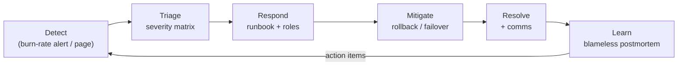

# sre-runbooks-incident-toolkit

[](https://sre.google/)
[](https://prometheus.io/)
[](https://grafana.com/)
[](LICENSE)

A working SRE toolkit: **error-budget policy**, **incident-response runbooks**, a
**severity matrix**, a **postmortem template**, and **Confluent-Kafka-on-Kubernetes
monitoring** (Prometheus alert rules + a Grafana dashboard)  plus helper scripts for
on-call triage.

> Distilled from running SLO-driven reliability for production services: defining
> SLIs/SLOs, wiring multi-burn-rate alerts, and cutting MTTD/MTTR through repeatable
> runbooks and blameless postmortems.

## Incident lifecycle



## What's here

```
slo/
  error-budget-policy.md      # what happens when the budget burns
  slo-catalog.md              # example SLIs/SLOs per service tier
runbooks/
  incident-response.md        # roles (IC/Ops/Comms), comms cadence, sev flow
  severity-matrix.md          # SEV1–SEV4 definitions + response times
  high-error-rate.md          # service-level 5xx burn runbook
  kafka-consumer-lag.md       # Confluent Kafka lag triage
postmortems/
  TEMPLATE.md                 # blameless postmortem template
  example-2026-01-payments-outage.md
monitoring/kafka/
  prometheus-rules.yaml       # Kafka broker + consumer-lag alerts
  grafana-dashboard.json      # Confluent Kafka on k8s dashboard
scripts/
  ack-page.sh                 # acknowledge a PagerDuty incident from CLI
  error-budget.py             # compute remaining error budget from Prometheus
  kafka-lag-top.sh            # top consumer groups by lag
```

## Error-budget policy (summary)

| Budget remaining | Policy |
|------------------|--------|
| > 50% | Ship freely. |
| 10–50% | Ship, but prioritize reliability fixes alongside features. |
| < 10% | **Feature freeze**  only reliability work and approved exceptions until budget recovers. |
| Exhausted | Freeze + incident review; SLO/target re-evaluated. |

Full policy: [slo/error-budget-policy.md](slo/error-budget-policy.md).

## Using the scripts

```bash
# Remaining 30-day error budget for a service (reads Prometheus)
PROM_URL=http://prometheus:9090 ./scripts/error-budget.py orders 99.9

# Top Kafka consumer groups by lag (needs kafka-exporter metrics in Prometheus)
PROM_URL=http://prometheus:9090 ./scripts/kafka-lag-top.sh
```

## License

MIT © Ayushi Shrotriya
